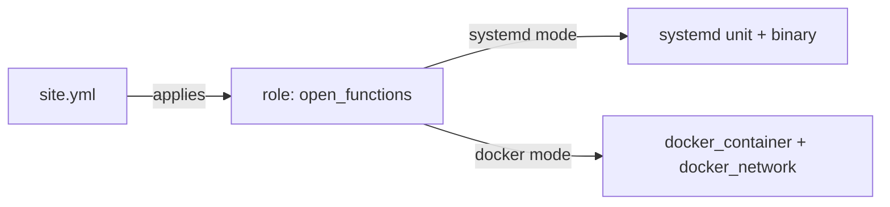

# open-functions Ansible deployment

## Table of contents

- [Overview](#overview)
- [Prerequisites](#prerequisites)
- [Install collection requirements](#install-collection-requirements)
- [Usage](#usage)
- [Inventory](#inventory)
- [Variables](#variables)
- [Tags](#tags)
- [Idempotency](#idempotency)
- [Co-location with open-pubusb](#co-location-with-open-pubusb)

## Overview

This directory deploys open-functions to a host using the `open_functions` role, either as a
systemd service (`open_functions_deploy_mode=systemd`) or as a Docker container
(`open_functions_deploy_mode=docker`). `site.yml` is the entry-point playbook and
applies the `open_functions` role to the `open_functions` inventory group.



## Prerequisites

Common to both modes:

- The target host is reachable over SSH with a `become`-capable account.

systemd mode:

- Linux x86_64 or aarch64.
- systemd 245 or newer.
- cgroup v2, if using memory limits.
- To build from source (`open_functions_build_mode=host`) rather than deploy a
  prebuilt release binary: a Rust toolchain on the target host. To build in
  a container instead (`open_functions_build_mode=container`): Docker on the target
  host.
- HTTPS reachability to GitHub Releases (for downloading the `open-functions`
  binary and its checksum file).
- Python functions (002-python-runtime): `open_functions_python_mode` defaults
  to `auto` (falls back to `container` if no system `python3.14` is found)
  under systemd, and is always forced to `container` under docker mode (the
  distributed image has no Python/uv of its own -- see `docker/Dockerfile`).
  `python.mode = container` -- explicit or fallen-back-to -- requires
  `open_functions_enable_docker: true`, same as `build.mode = container`; the
  role's `preflight` tag rejects the combination otherwise. Set
  `open_functions_extra_env` for proxy/index vars (`UV_*`/`PIP_*`/
  `HTTP_PROXY`/etc.) `uv`/`pip` need but this role has no dedicated variable
  for -- see `contracts/ops-config.md`'s 002 delta.

Docker mode:

- Docker 24 or newer on the target host.
- The `community.docker` Ansible collection on the control node (see
  below).

## Install collection requirements

```bash
ansible-galaxy collection install -r requirements.yml
```

This installs `community.docker`, which the `open_functions` role's Docker deploy
mode uses (`community.docker.docker_container`,
`community.docker.docker_network`). It is safe to install even if you only
ever use systemd mode.

## Usage

```bash
ansible-playbook -i inventory/hosts.yml site.yml -e open_functions_deploy_mode=systemd
ansible-playbook -i inventory/hosts.yml site.yml -e open_functions_deploy_mode=docker
```

`open_functions_deploy_mode` defaults to `systemd` in the role, so it can also be set
per-host in the inventory instead of passed with `-e` on every run (see
`inventory/hosts.example.yml`).

A handful of variables are worth setting explicitly on a first run:

| Variable | Why you'd set it |
|---|---|
| `open_functions_deploy_mode` | Choose `systemd` or `docker`. |
| `open_functions_version` | Pin a specific open-functions release instead of tracking latest. |
| `open_functions_admin_token` | Required (role preflight fails otherwise) if `open_functions_admin_bind_address` is set to anything non-loopback. Use Ansible Vault to store it. |

The rest of the public variables — ports, data directory, open-pubusb
integration, Docker network name, verification behavior, and so on — have
sane defaults. See `roles/open_functions/defaults/main.yml` for the full
list and each variable's own comment.

## Inventory

Copy `inventory/hosts.example.yml` to your own inventory file (e.g.
`inventory/hosts.yml`) and adjust hostnames, connection details, and
per-host variables. It includes two worked examples: a standalone systemd
deployment, and a Docker deployment co-located with open-pubusb.

## Variables

See `roles/open_functions/defaults/main.yml` for the authoritative list of
defaults and each variable's own comment.

## Tags

The `open_functions` role supports `preflight`, `install`, `config`, `service`, and
`verify` tags, so a targeted run can skip the full deploy. For example, to
push a configuration change and restart the service without repeating
install or verification:

```bash
ansible-playbook -i inventory/hosts.yml site.yml --tags config,service
```

## Idempotency

A second run of `site.yml` with the same variables against a host that is
already in the desired state reports `changed=0` for every task — no
service restarts, no file rewrites, no container recreation.

## Co-location with open-pubusb

The standard setup runs open-pubusb (a sibling Pub/Sub-compatible local service,
ports 8085/8086; see the separate `~/workspace/siosig/open-pubusb` project — it is
not part of this repository) and open-functions (ports 8080/8081) on the same host,
with open-functions configured to call open-pubusb for Pub/Sub trigger registration and
event delivery.

`site.yml` applies only the `open_functions` role, since the `open_pubusb` role lives in
the open-pubusb project rather than in this repository. Deploy open-pubusb separately,
using that project's own playbook, against the same host or inventory. If
you vendor the `open_pubusb` role into this repo (e.g. under
`ansible/roles/open_pubusb`) or pull it in via a separate Galaxy requirement,
`site.yml` documents where to add it — apply `open_pubusb` before `open_functions` in the
`roles:` list.

In Docker mode, the standard co-location example connects both containers
to the same `open_functions_docker_network` (default: `open-functions`) and addresses each by
container name:

```yaml
open_functions_docker_network: open-functions
open_functions_pubsub_base_url: http://open-pubusb:8085
open_functions_pubsub_push_base_url: http://open-functions:8080
```

See `inventory/hosts.example.yml` for the full worked example.
