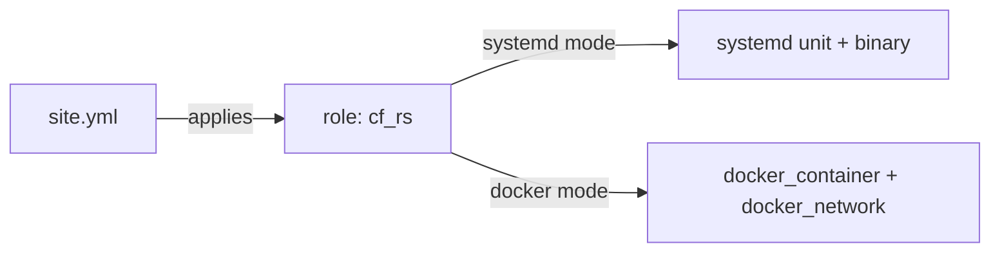

# cf-rs Ansible deployment

## Table of contents

- [Overview](#overview)
- [Prerequisites](#prerequisites)
- [Install collection requirements](#install-collection-requirements)
- [Usage](#usage)
- [Inventory](#inventory)
- [Variables](#variables)
- [Tags](#tags)
- [Idempotency](#idempotency)
- [Co-location with ps-rs](#co-location-with-ps-rs)

## Overview

This directory deploys cf-rs to a host using the `cf_rs` role, either as a
systemd service (`cf_rs_deploy_mode=systemd`) or as a Docker container
(`cf_rs_deploy_mode=docker`). `site.yml` is the entry-point playbook and
applies the `cf_rs` role to the `cf_rs` inventory group.



## Prerequisites

Common to both modes:

- The target host is reachable over SSH with a `become`-capable account.

systemd mode:

- Linux x86_64 or aarch64.
- systemd 245 or newer.
- cgroup v2, if using memory limits.
- To build from source (`cf_rs_build_mode=host`) rather than deploy a
  prebuilt release binary: a Rust toolchain on the target host. To build in
  a container instead (`cf_rs_build_mode=container`): Docker on the target
  host.
- HTTPS reachability to GitHub Releases (for downloading the `cf-rs`
  binary and its checksum file).

Docker mode:

- Docker 24 or newer on the target host.
- The `community.docker` Ansible collection on the control node (see
  below).

## Install collection requirements

```bash
ansible-galaxy collection install -r requirements.yml
```

This installs `community.docker`, which the `cf_rs` role's Docker deploy
mode uses (`community.docker.docker_container`,
`community.docker.docker_network`). It is safe to install even if you only
ever use systemd mode.

## Usage

```bash
ansible-playbook -i inventory/hosts.yml site.yml -e cf_rs_deploy_mode=systemd
ansible-playbook -i inventory/hosts.yml site.yml -e cf_rs_deploy_mode=docker
```

`cf_rs_deploy_mode` defaults to `systemd` in the role, so it can also be set
per-host in the inventory instead of passed with `-e` on every run (see
`inventory/hosts.example.yml`).

A handful of variables are worth setting explicitly on a first run:

| Variable | Why you'd set it |
|---|---|
| `cf_rs_deploy_mode` | Choose `systemd` or `docker`. |
| `cf_rs_version` | Pin a specific cf-rs release instead of tracking latest. |
| `cf_rs_admin_token` | Required (role preflight fails otherwise) if `cf_rs_admin_bind_address` is set to anything non-loopback. Use Ansible Vault to store it. |

The rest of the public variables — ports, data directory, ps-rs
integration, Docker network name, verification behavior, and so on — have
sane defaults. See `roles/cf_rs/defaults/main.yml` for the full list, or
`specs/001-cloud-functions-local/contracts/ansible-vars.md` for the
documented contract.

## Inventory

Copy `inventory/hosts.example.yml` to your own inventory file (e.g.
`inventory/hosts.yml`) and adjust hostnames, connection details, and
per-host variables. It includes two worked examples: a standalone systemd
deployment, and a Docker deployment co-located with ps-rs.

## Variables

See `roles/cf_rs/defaults/main.yml` for the authoritative list of defaults,
and `specs/001-cloud-functions-local/contracts/ansible-vars.md` for the
documented public variable contract this playbook relies on.

## Tags

The `cf_rs` role supports `preflight`, `install`, `config`, `service`, and
`verify` tags, so a targeted run can skip the full deploy. For example, to
push a configuration change and restart the service without repeating
install or verification:

```bash
ansible-playbook -i inventory/hosts.yml site.yml --tags config,service
```

## Idempotency

A second run of `site.yml` with the same variables against a host that is
already in the desired state reports `changed=0` for every task — no
service restarts, no file rewrites, no container recreation.

## Co-location with ps-rs

The standard setup runs ps-rs (a sibling Pub/Sub-compatible local service,
ports 8085/8086; see the separate `~/workspace/siosig/ps-rs` project — it is
not part of this repository) and cf-rs (ports 8080/8081) on the same host,
with cf-rs configured to call ps-rs for Pub/Sub trigger registration and
event delivery.

`site.yml` applies only the `cf_rs` role, since the `ps_rs` role lives in
the ps-rs project rather than in this repository. Deploy ps-rs separately,
using that project's own playbook, against the same host or inventory. If
you vendor the `ps_rs` role into this repo (e.g. under
`ansible/roles/ps_rs`) or pull it in via a separate Galaxy requirement,
`site.yml` documents where to add it — apply `ps_rs` before `cf_rs` in the
`roles:` list.

In Docker mode, the standard co-location example connects both containers
to the same `cf_rs_docker_network` (default: `cf-rs`) and addresses each by
container name:

```yaml
cf_rs_docker_network: cf-rs
cf_rs_pubsub_base_url: http://ps-rs:8085
cf_rs_pubsub_push_base_url: http://cf-rs:8080
```

See `inventory/hosts.example.yml` for the full worked example.
